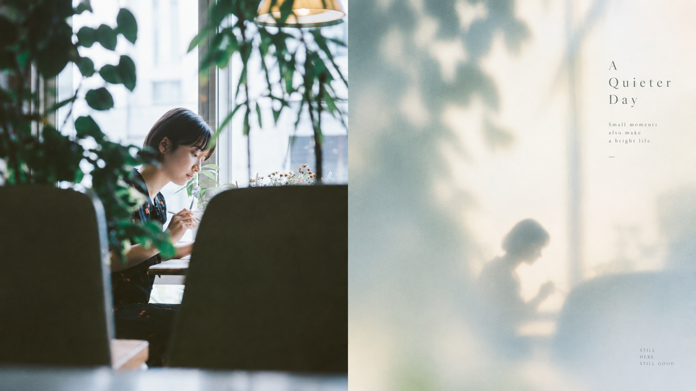
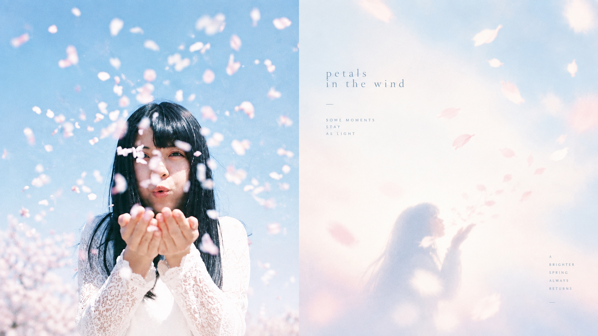
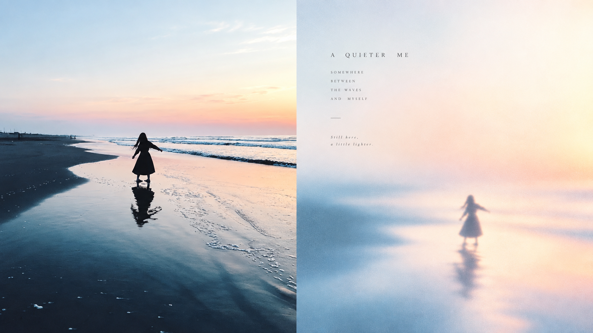
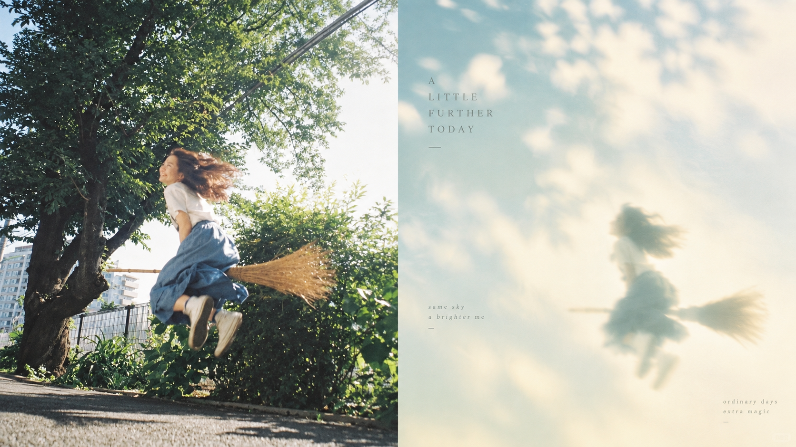
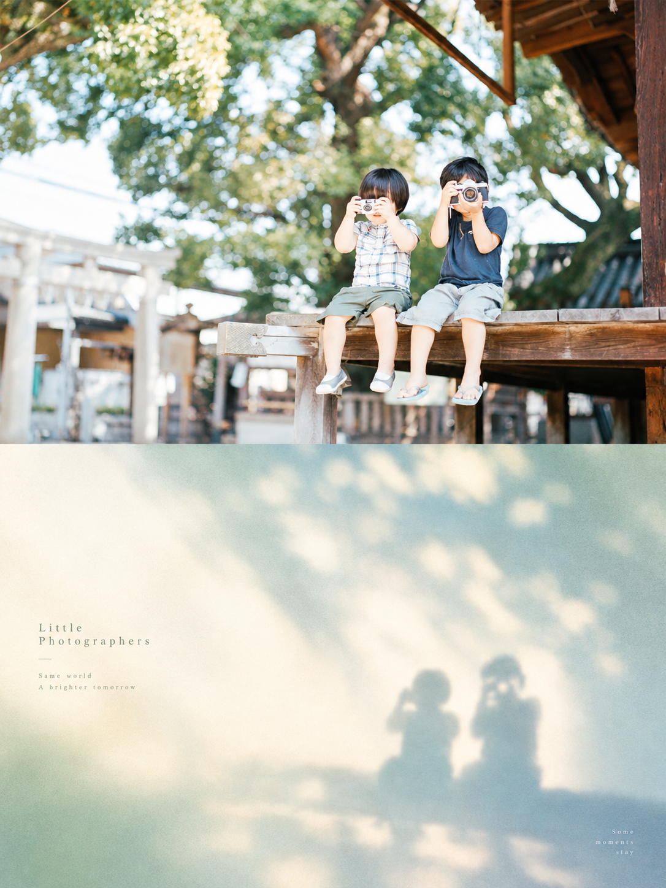
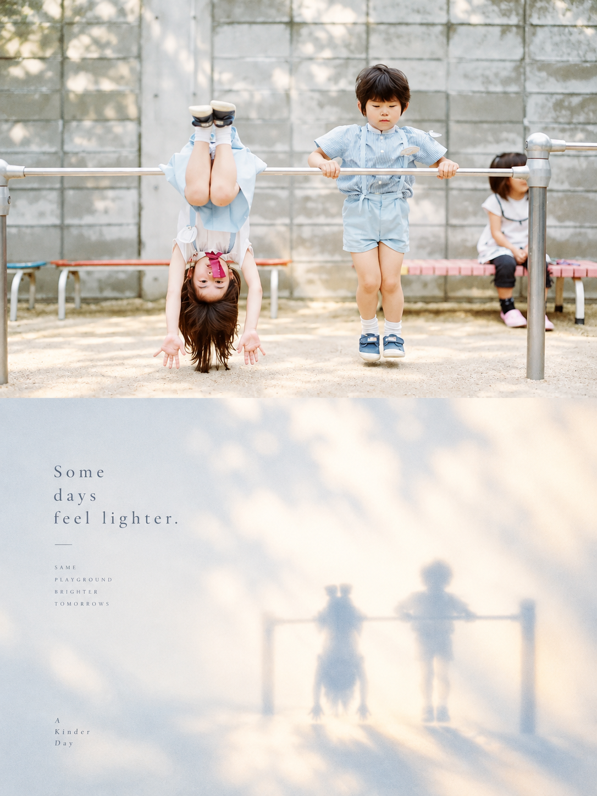
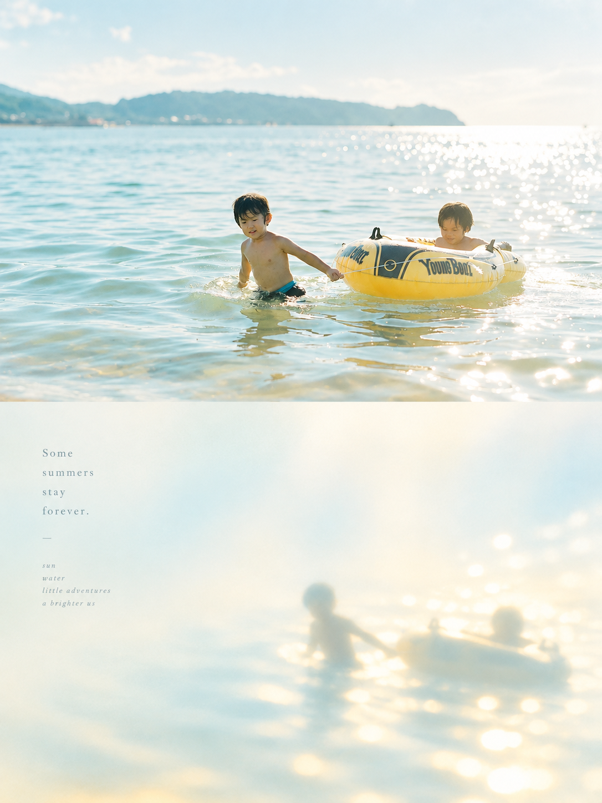

<div align="center">

# XXD Panel 204｜柔焦光影记忆小品

把普通照片重新导演成可独立使用的艺术海报；保留主体记忆点，让材质、构图与留白共同工作。

<a href="README.md">简体中文</a> · <a href="README.en.md">English</a> · <a href="README.ja.md">日本語</a> · <a href="README.ko.md">한국어</a> · <a href="README.ar.md">العربية</a>

</div>

## 16:9 左右双联样张

以下四张为独立素材，完整 16:9 画布：左为现实摄影，右为本 Panel 设计转译，严格 50:50。文案由模型按原始提示词从当前照片智能生成。

<table>
  <tr>
    <td width="50%"></td>
    <td width="50%"></td>
  </tr>
  <tr>
    <td width="50%"></td>
    <td width="50%"></td>
  </tr>
</table>

## 3:4 上下双联样张

以下四张使用与 16:9 组完全不同的四张独立素材，重新生成完整 3:4 上下双联画布；上部保留现实摄影，下部遵循本 Panel 原始提示词重构。英文配字只从当前照片的内容、情绪或隐喻中生成。

<table>
  <tr>
    <td width="50%"></td>
    <td width="50%"></td>
  </tr>
  <tr>
    <td width="50%"></td>
    <td width="50%"></td>
  </tr>
</table>

## 适用场景与解决的问题

适合个人摄影整理、独立出版、展览练习和生活方式视觉创作。原图构图普通、背景杂乱或主体偏小，也可以通过删减、重组、裁切和尺度变化重新建立重点，而不是把照片套上滤镜。

整体呈现**小尺度光影焦点、大面积负空间、柔焦晕光、粉雾冷暖关系与极简编辑排版**共同构成的高级视觉效果，像艺术杂志、文化品牌或展览视觉中的情绪化极简海报。无论主体是人物、建筑、动物、植物、器物、交通工具或自然景观，都应保留其最核心的视觉灵魂，而不是完整复刻。

## 原始提示词

[中文完整原稿](references/original-prompt/zh-CN.md)逐字保留，是运行时唯一的创作与审美权威。本批提供五语使用说明，不另做四份长原稿译文；风格简介只用于检索，不得替代原文。

## 快速判断：Panel 204 适合你吗？

既要保留源图身份，也要重新构图；既要材质特征，也要主动留白。可选准确文字、智能文案或无文字；支持单图、递归目录批量以及下方四种交付模式。

## 它如何把照片变成成品

理解主体与关系 → 按原文提炼视觉语言 → 删除无关细节 → 重组尺度、位置与留白 → 生成少量贴图文案 → 检查比例、文字与成品

## 成品中最容易识别的特点

整体呈现**小尺度光影焦点、大面积负空间、柔焦晕光、粉雾冷暖关系与极简编辑排版**共同构成的高级视觉效果，像艺术杂志、文化品牌或展览视觉中的情绪化极简海报。无论主体是人物、建筑、动物、植物、器物、交通工具或自然景观，都应保留其最核心的视觉灵魂，而不是完整复刻。避免写实插画、背景填满、复杂细节、硬边渐变、商业宣传感、模板化海报感和廉价滤镜。

## 四种输出模式

- `top-bottom`：整张画布只有上下两个全宽区域，现实照片在上、设计在下，严格各占 50%。
- `left-right`：整张画布只有左右两个全高区域，现实照片在左、设计在右，严格各占 50%，不会旋转成上下结构。
- `design-only`：整张画布只呈现 Panel 204 的设计转译，照片只作为不可见参考。
- `wallpaper-pack`：按手机、iPad、桌面和手表分别生成完整设计壁纸，可选 `linked` 连贯套装或 `independent` 四张独立。

支持多选模式与比例（`1:1`、`3:4`、`4:3`、`4:5`、`5:4`、`2:3`、`3:2`、`9:16`、`16:9`、`21:9`、`5:7`、`7:5` 或准确像素），以及模型生成文字、准确文字和无文字。传入目录会递归扫描图片，每张源图独立处理，共用一次交付设置；最终 PNG 平铺放入一个新任务目录。

## 开始使用

从 GitHub 安装：

```bash
npx skills add https://github.com/nevertoday/xxd-panel-204 --skill xxd-panel-204
```

安装后重新启动 Agent 会话，然后调用 `$xxd-panel-204`。也可以按需追加 `--global --agent codex --yes` 做用户级安装。

常用调用示例：

```text
/xxd-panel-204 photo.jpg --mode top-bottom --size 3:4 --text prompt --locale zh-CN
/xxd-panel-204 photo.jpg --mode left-right --size 16:9 --text prompt --locale en-US
/xxd-panel-204 photo.jpg --mode design-only --size 9:16 --text none --prefs off
/xxd-panel-204 ./photos --mode design-only --size auto,3:4 --text prompt --locale ja-JP
```

完整运行契约见 [SKILL.md](SKILL.md)；运行适配器见 [英文](references/xxd-panel-204-prompt.en.md) 与 [中文](references/xxd-panel-204-prompt.zh-CN.md)。

<!-- xxd-readme-ads:start -->
## 关于 XXD

XXD 是小小东品牌名的缩写，本项目由小小东创建并维护： [@xiaoxiaodong01](https://x.com/xiaoxiaodong01).

## 广告信息｜XXD 付费服务与会员

> **广告与商业信息声明：** 以下二维码、会员与付费服务链接属于小小东的广告信息。是否扫码或购买完全自愿，不影响本开源项目的访问与使用。


<!-- xxd-panel-command-system:start -->

将军 Skills 已包含在 699 元/年的统一会员权益中，无需单独购买。

| 层级 | Skill | 负责什么 |
|---|---|---|
| **将军级** | [`xxd-panel-all`](https://github.com/xiaoxiaodong-ai/xxd-panel-all) | 识别当前可用的编号 Skills；按图片、主题和用途推荐；按编号点将；组织同图多风格试稿；为图片文件夹批量分配并逐项派发。 |
| **士兵级** | `xxd-panel-NNN` | 每个编号只执行自己独立的原始提示词与审美，把将军派发的单个任务完成为成品。 |

<!-- xxd-panel-command-system:end -->

### 知识星球＋成员提示词库＋Skills 所有将军会员 · 699 元/年

[知识星球](https://wx.zsxq.com/group/15554814142882)、[小小东成员提示词库](https://vip.xiaoxiaodong.ai/)与 Skills 所有将军会员是同一份会员权益：**一次年费同时开通三项权益，无需重复付费。**

[Knowledge Planet](https://wx.zsxq.com/group/15554814142882) · [Member Prompt Library](https://vip.xiaoxiaodong.ai/)

<p align="center"><a href="https://xiaoxiaodong.pages.dev/assets/wechat-qr.png"></a></p>
<!-- xxd-readme-ads:end -->

## 许可证

本项目（包括 Skill、提示词、脚本、文档及随附样张）采用 **PolyForm Noncommercial License 1.0.0**。完整法律条文请见 [LICENSE](LICENSE)，官方页面见 <https://polyformproject.org/licenses/noncommercial/1.0.0>。

许可范围说明：

- 个人可以用于学习、研究、实验、测试、兴趣项目和私人娱乐；慈善机构、教育机构、公共研究/安全/卫生机构、环保组织及政府机构也可以使用。
- 在**非商业目的**下，你可以使用、复制、修改、制作衍生作品并分享；分享时必须同时提供本许可证（或上面的链接）以及作者提供的所有 `Required Notice:` 声明。
- 不允许用于商业产品或服务、收费交付、出售访问权或许可，或任何预期会带来商业应用的用途。需要商业使用时，请先向版权方另行取得书面许可。
- 本协议只授予其中明确写出的著作权许可和有限的专利许可，不授予商标、品牌名称或其他未明确授予的权利，也不能把你的许可再转授给他人。
- 如果收到书面违约通知，须在 32 天内纠正并采取实际补救措施，否则许可会立即终止；就专利侵权提出书面主张也会终止专利许可。
- 内容按“现状”提供，在法律允许的范围内不作任何担保，使用风险和可能的损失由使用者自行承担。
